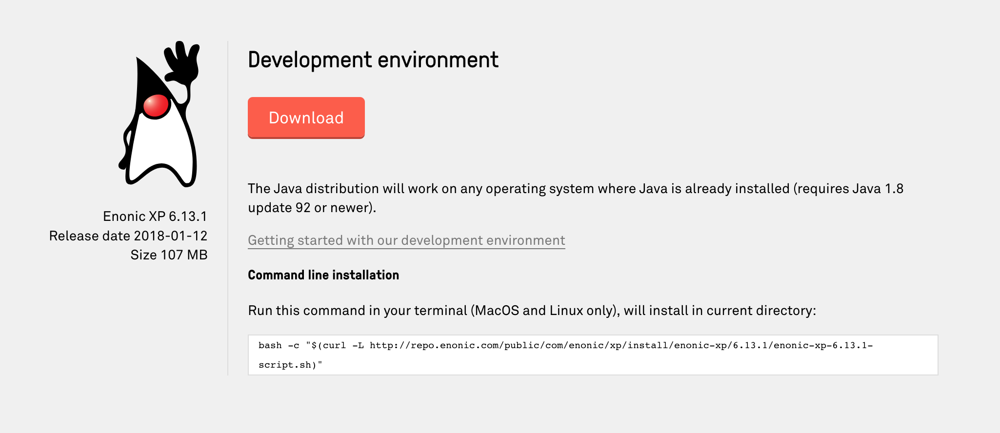

= Installing the Enonic XP Development Environment

*Instructions to get the Enonic XP Developer Environment running on your local computer*

If you experience problems, check out the <<troubleshooting>> section.

TIP: This guide is also availalable as a video. Watch the video below, or continue reading:

video::Sr7X9cmOvhw[youtube]

//
//  

//    <iframe style="position: absolute; top: 0; left: 0; width: 100%; height: 100%;" src="https://www.youtube.com/embed/Sr7X9cmOvhw?rel=0" frameborder="0" allowfullscreen></iframe>
//  

//

== Get the Java Development Kit

CAUTION: To run Enonic XP in development mode, you need the Java Development Kit (JDK) 1.8.92 JDK or newer installed. NB! XP currently dos not support Java 1.9.

=== Check your JDK Version

If you are unsure what JDK version you have (or even if you have one), run the following in your terminal/shell:

  javac -version

This should produce a response such as: `javac 1.8.0_112`

Having problems with your existing Java installation? Check out our <<troubleshooting,troubleshooting section>>

=== Install the JDK

If it turns out you're on the wrong Java version, or missing it completely, follow these steps:

Visit this page to get the latest JDK http://www.oracle.com/technetwork/java/javase/downloads/jdk8-downloads-2133151.html

. *Accept* the License Agreement
. *Select* the distribution that fits your operating system
. *Install JDK* by following the instructions

== Installing Enonic XP

Enonic XP is available in a simple universal distribution file - supporting all platforms (Windows, Linux, MacOS etc)

. *Download Enonic XP* from https://enonic.com/downloads (Choose developer distribution). Here you can also find information about the latest release.
+

+
. *Unzip* the file to a suitable location

Alternatively run the command-line version (MacOS/Linux only), replace <release> with the version you want i.e. `6.13.1`

  curl -O http://repo.enonic.com/public/com/enonic/xp/distro/<version>/distro-<release>.zip
  unzip distro-<release>.zip

Start the server
----------------

Run the respective commands to start the server:

  xp-install-folder/bin/server.sh

*Windows users* can run `xp-install-folder\bin\server.bat`

When successfully started, the following will appear at the end of the log:

  12:53:14.302 INFO  c.e.x.l.framework.FrameworkService - Started Enonic XP in **** ms

* Your server should now be available on http://localhost:8080
* Log into the admin console with username: `su` and password: `password`

== Troubleshooting

Verify that you comply with the minimum requirements for running XP on your local machine

****
[CAUTION]
====
* Any OS supporting the required version of Java (Mac, Linux, Windows etc)
* At least 1 GB of available memory
* HTTP port 8080 should be available (this can be changed if needed, see :ref:`configuration`)
====
****
